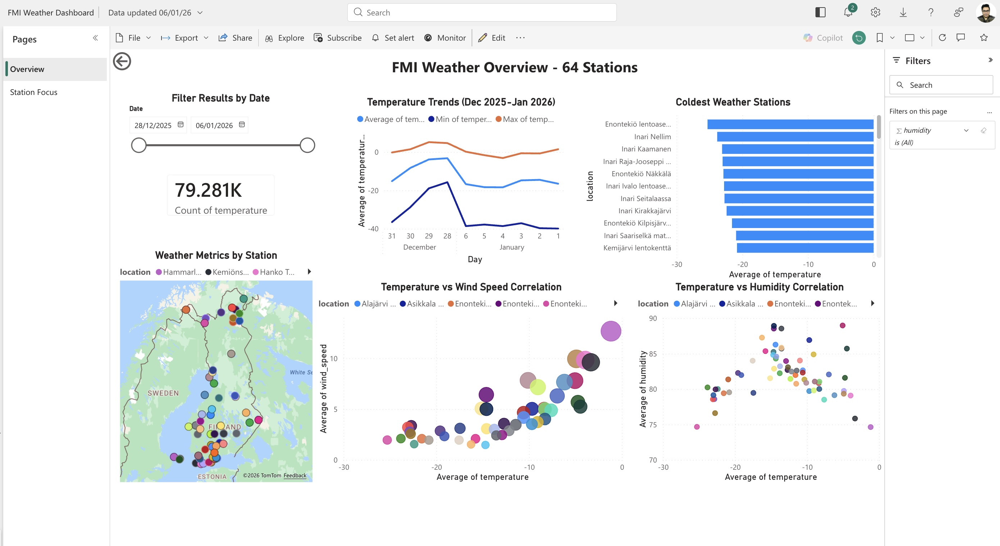
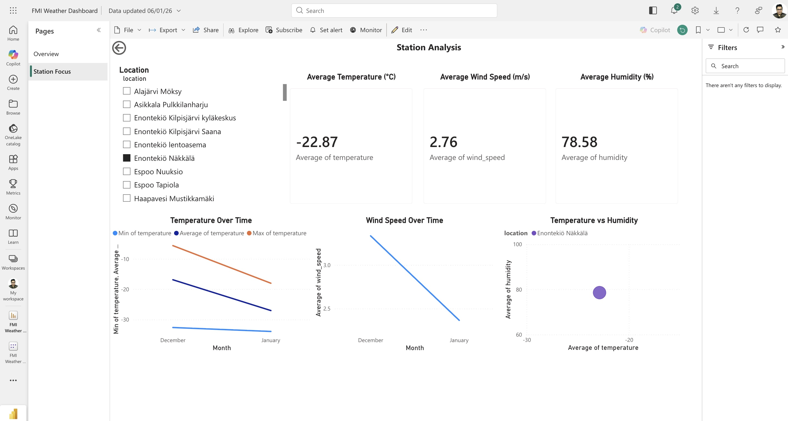

# Power BI Dashboard

Professional business intelligence dashboard for FMI Weather Pipeline.

## 📥 Download & Open

**File:** [FMI_Weather_Dashboard.pbix](FMI_Weather_Dashboard.pbix)

**Requirements:**
- [Power BI Desktop](https://powerbi.microsoft.com/desktop/) (free download)
- No additional setup needed - data is embedded!

**How to Open:**
1. Download the .pbix file
2. Open with Power BI Desktop
3. Explore the interactive dashboard

## 📊 Dashboard Features

### Page 1: Overview
- **79K+ observations** from 64 weather stations
- **Interactive map** showing geographic distribution across Finland
- **Temperature trends** (December 2025 - January 2026)
- **Date range filter** for custom time periods
- **Station comparison** bar charts

### Page 2: Station Analysis
- **Detailed drill-down** for individual stations
- **Key metrics cards**: Temperature, Wind Speed, Humidity
- **Time series analysis**: Min/Avg/Max trends
- **Correlation analysis**: Temperature vs Humidity scatter plot

## 🗓️ Data Coverage

**Time Period:** December 28, 2025 - January 6, 2026  
**Stations:** 64 active weather stations across Finland  
**Observations:** 79,281 total measurements  
**Update Frequency:** Historical snapshot (10-minute intervals during collection period)

## 📸 Screenshots

### Overview Page

*Interactive overview showing all 64 stations with temperature trends and geographic distribution across Finland*

### Station Analysis Page

*Detailed station-level analysis with time series and correlation visualizations*

## 💡 Use Cases

- **Executive Reporting**: High-level weather metrics for decision makers
- **Geographic Analysis**: Spatial distribution of weather patterns
- **Station Performance**: Individual station monitoring and comparison
- **Trend Analysis**: Historical temperature and wind patterns
- **Data Quality**: Observation counts and completeness metrics

## 🔧 Technical Details

**Data Source:** Google BigQuery (embedded snapshot)  
**Visualizations:** Maps, Line Charts, Bar Charts, Scatter Plots, KPI Cards  
**Interactivity:** Date filters, drill-through pages, cross-filtering 

---

**Purpose:** Provides enterprise-grade business intelligence reporting to complement the technical Streamlit dashboard for stakeholder communication
